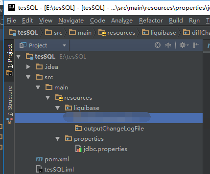
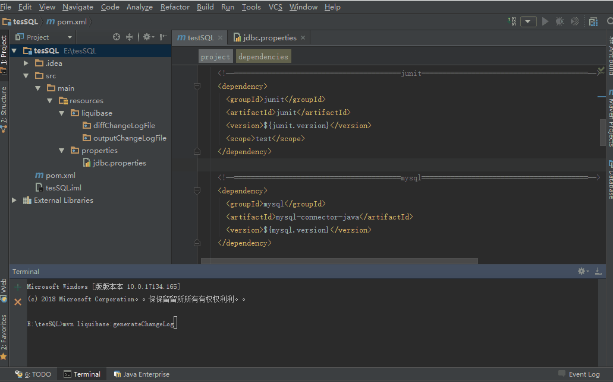

[](http://www.liquibase.org/documentation/maven/)


总操作流程：
- 1、创建maven项目；
- 2、创建文件夹和文件；
- 3、修改pom.xml;
- 4、测试看效果;

[](https://github.com/lidekai/tesSQL.git)
***

# 创建maven项目

[](https://github.com/OurNotes/CCN/blob/master/6.%E5%90%8E%E5%8F%B0/1.java/3.Javaweb%E4%B9%8B%E6%95%B4%E5%90%88%E4%BE%8B%E5%AD%90/2.ssm%2Bm%2Bsql%E7%9A%84%E6%95%B4%E5%90%88%E6%AD%A5%E9%AA%A4%EF%BC%88idea%E5%B7%A5%E5%85%B7%E4%B8%8B%EF%BC%89/1-ssm%E6%95%B4%E5%90%88%E4%B9%8B%E7%94%A8maven%E5%88%9B%E5%BB%BAweb%E9%A1%B9%E7%9B%AE.md)

# 创建文件夹和文件
- 项目结构



### 1、创建文件夹
- resources
    - liquibase
        - outputChangeLogFile

### 2、创建文件
- jdbc.properties
```
# 数据库据连接
driver=com.mysql.jdbc.Driver
url=jdbc:mysql://192.168.57.131:3306/test?useUnicode=true
username=dk
password=DKLi123456!
# 生成文件的路径
outputChangeLogFile=src/main/resources/liquibase/outputChangeLogFile/changelog_original.xml
```
# 修改pom.xml
### 1、添加包
```
<properties>
    <junit.version>4.11</junit.version>
    <mysql.version>5.1.46</mysql.version>
    <liquibase.version>3.6.1</liquibase.version>
</properties>

<dependencies>
    <!--========================================junit========================================-->
    <dependency>
      <groupId>junit</groupId>
      <artifactId>junit</artifactId>
      <version>${junit.version}</version>
      <scope>test</scope>
    </dependency>

    <!--========================================mysql========================================-->
    <dependency>
      <groupId>mysql</groupId>
      <artifactId>mysql-connector-java</artifactId>
      <version>${mysql.version}</version>
    </dependency>

    <!--========================================liquibase========================================-->
    <dependency>
      <groupId>org.liquibase</groupId>
      <artifactId>liquibase-core</artifactId>
      <version>${liquibase.version}</version>
    </dependency>
</dependencies>
```
### 2、添加liquibase配置
```
       <!--========================================liquibase的配置========================================-->
        <plugin>
          <groupId>org.liquibase</groupId>
          <artifactId>liquibase-maven-plugin</artifactId>
          <version>3.5.3</version>
          <configuration>
            <!--共享的LiquiBase配置 -->
            <propertyFileWillOverride>true</propertyFileWillOverride>
            <!--连接数据库的配置文件路径-->
            <propertyFile>${basedir}/src/main/resources/properties/jdbc.properties</propertyFile>
            <!--输出文件的编码 -->
            <outputFileEncoding>UTF-8</outputFileEncoding>
          </configuration>
        </plugin>
```
# 测试看效果
- 命令：
```
mvn liquibase:generateChangeLog
```
- 成功标志：
