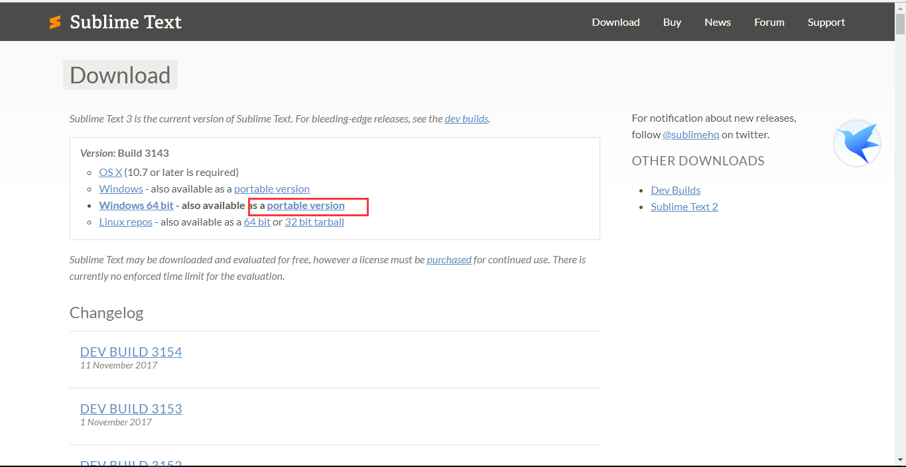
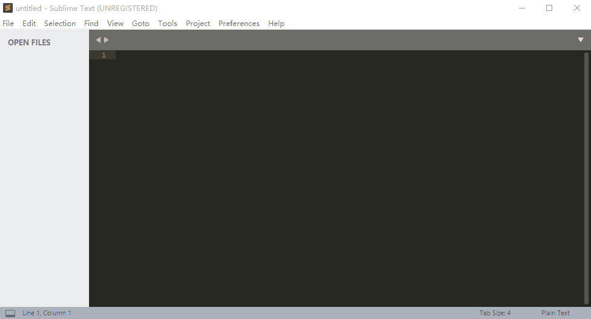
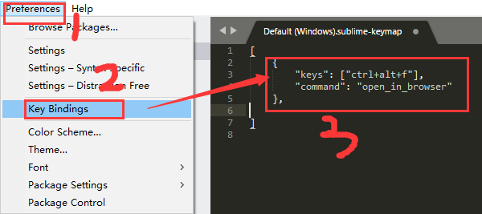
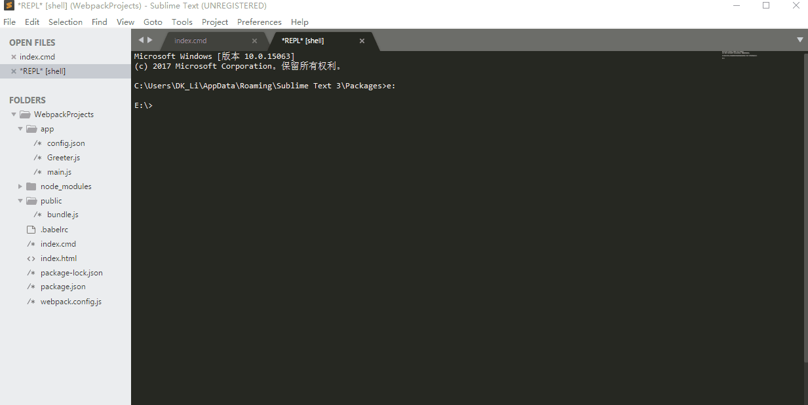

操作总流程：
- 1、[下载安装](#Sublime-01)
- 2、[打开Package Control，安装插件](#Sublime-02)
- 3、[配置环境变量](#Sublime-03)

----------

# <a name="Sublime-01" href="#" >下载安装</a>
[](http://www.sublimetext.com/3)



# <a name="Sublime-02" href="#" >打开Package Control，安装插件</a>
- 操作如下：



# <a name="Sublime-03" href="#" >配置环境变量</a>
在path添加它的安装路径所在D:\SublimeText3

## 插件:
[](http://blog.csdn.net/jianhua0902/article/details/43761899)

###  1、localization:菜单栏中文化
###  2、View In Browser：快捷键浏览器打开html
- 设置：



```
	{
		"keys": ["ctrl+alt+f"],
		"command": "open_in_browser"
	},
```
### 3、sublimeREPL：执行命令行脚本

### 4、Alignment：快捷键”=”号对齐
[](https://blog.csdn.net/sugang_ximi/article/details/48464253)


```
	{
		"keys": ["ctrl+shift+alt+a"],
		"command": "alignment"
	},
```
### 5、Bracket Highlighter：代码匹配，便于查看起始和结束标记
### 6、DocBlockr：生成优美注释
### 7、ColorPicker：调色板
使用：快捷键Windows: ctrl+shift+c
### 8、AutoFileName：自动完成文件名的输入，如图片选取
使用：输入”/”即可看到相对于本项目文件夹的其他文件
### 9、Trailing spaces：检测并一键去除代码中多余的空格
设置：


```
	{
		"keys":["ctrl+shift+t"],
		"command":"delete_trailing_spaces"
	},
]
```
### 10、GBK Support：中文识别
