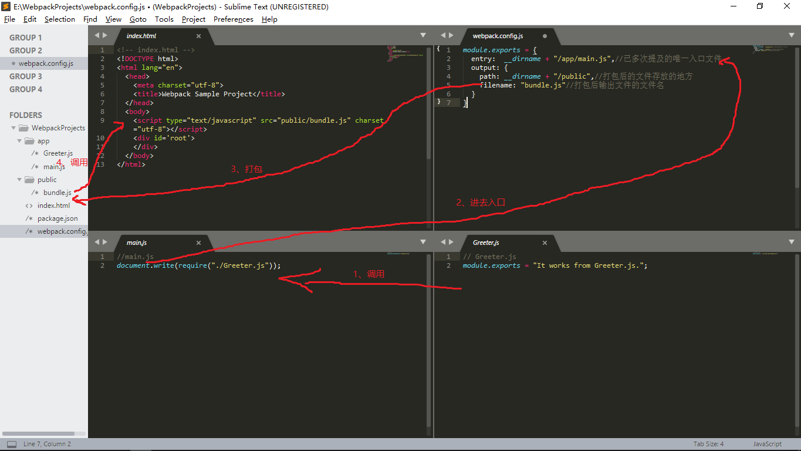
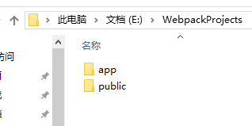

总操作流程：
- 1、创建三个文件夹
- 2、初始化
- 3、创建四个文件
- 4、打包
- 5、测试

[源代码](https://github.com/lidekai/WebpackProjects-SimpleHtml.git)

----------

代码结构



# 创建三个文件夹
1、WebpackProjects
2、app
3、public


# 初始化(cmd进入文件夹初始化)
```
cnpm init
```
# 创建三个文件
```
index.html --放在public文件夹中;
Greeter.js-- 放在app文件夹中;
main.js-- 放在app文件夹中;
webpack.config.js--放在根目录文件夹中
```
### 1、index.html代码
```
<!-- index.html -->
<!DOCTYPE html>
<html lang="en">
  <head>
    <meta charset="utf-8">
    <title>Webpack Sample Project</title>
  </head>
  <body>
  	<script type="text/javascript" src="public/bundle.js" charset="utf-8"></script>
    <div id='root'>
    </div>
  </body>
</html>
```
### 2、Greeter.js代码
```
// Greeter.js
module.exports = "It works from Greeter.js.";
```
### 3、main.js代码
```
//main.js
document.write(require("./Greeter.js"));
```
### 4、webpack.config.js代码
```
module.exports = {
  entry:  __dirname + "/app/main.js",//已多次提及的唯一入口文件
  output: {
    path: __dirname + "/public",//打包后的文件存放的地方
    filename: "bundle.js"//打包后输出文件的文件名
  }
}
```
# 打包
```
webpack
```
# 测试
点击打开html文件