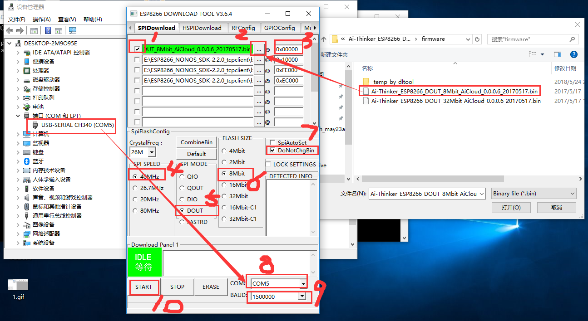
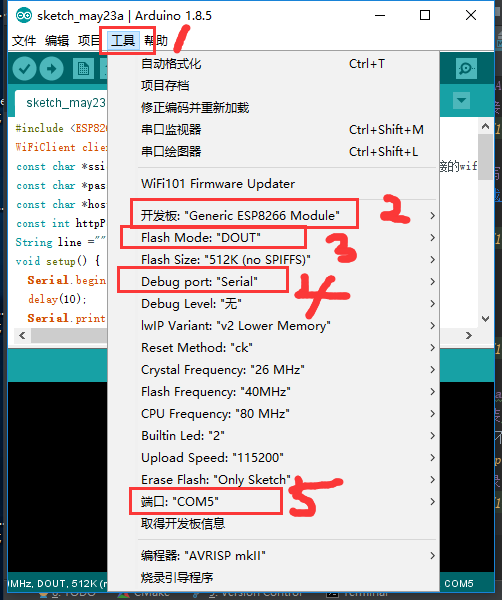
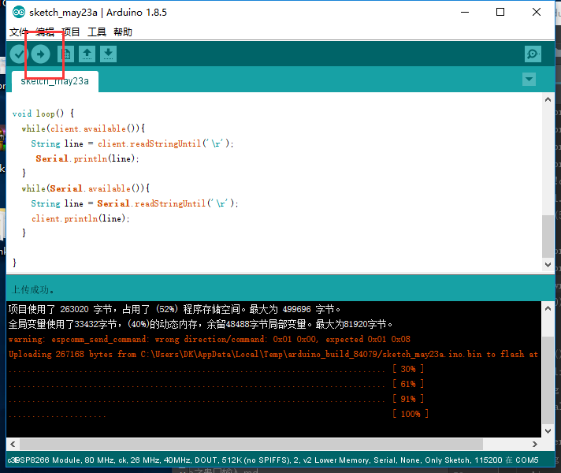
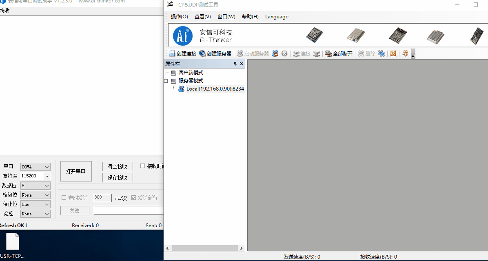

总操作流程：
- 1、8266烧录AT固件（这步不知道有什么作用，应该不需要，因为我之前烧录过，没清空过8266）；
- 2、8266烧录arduino历程；
- 3、arduino上传初始状态代码；
- 4、8266链接arduino；
- 5、测试；

***

# 8266烧录AT固件
### 1、链接usb转串口


### 2、烧写固件
[at固件下载](http://wiki.ai-thinker.com/esp8266/sdk)


`
烧录
`


# 8266烧录arduino历程
### 1、安装arduino的8266环境
下载时路径不要改，这是对应arduino ide中的路径
[下载](https://pan.baidu.com/s/1BtBVqKXy45XoW6loNiBxgw)
### 2、烧录




程序
```
#include <ESP8266WiFi.h>
WiFiClient client;
const char *ssid     = "xxxxx";//要加入的路由WiFi名字
const char *password = "xxxx";//要加入的路由WiFi密码
const char *host = "xxxxx";//服务器IP
const int httpPort =xxxx;//端口号
String line ="";
void setup() {
  Serial.begin(115200);
  delay(10);
  Serial.print("Connecting to ");
  Serial.println(ssid);
  WiFi.begin(ssid, password);
  while (WiFi.status() != WL_CONNECTED) {
    delay(500);
    Serial.print(".");
  }
  Serial.println("");
  Serial.println("WiFi connected");
  Serial.println("IP address: ");
  Serial.println(WiFi.localIP());
  while (!client.connect(host, httpPort)) {
    Serial.println("connection failed");
    delay(500);
  }
  Serial.print("connecting to ");
  Serial.println(host);
  client.write("successfully\r\n");//绑定apikey,修改成你自己的apikey
  delay(10);
}

void loop() {
  while(client.available()){
    String line = client.readStringUntil('\r');
     Serial.println(line);
  }
  while(Serial.available()){
    String line = Serial.readStringUntil('\r');
    client.println(line);
  }

}
```
`
注意：要是上传失败拔出usb转串口重新接上电脑
`


# arduino上传初始状态代码


# 8266链接arduino


# 测试
[安可信开发工具](http://wiki.ai-thinker.com/tools)



