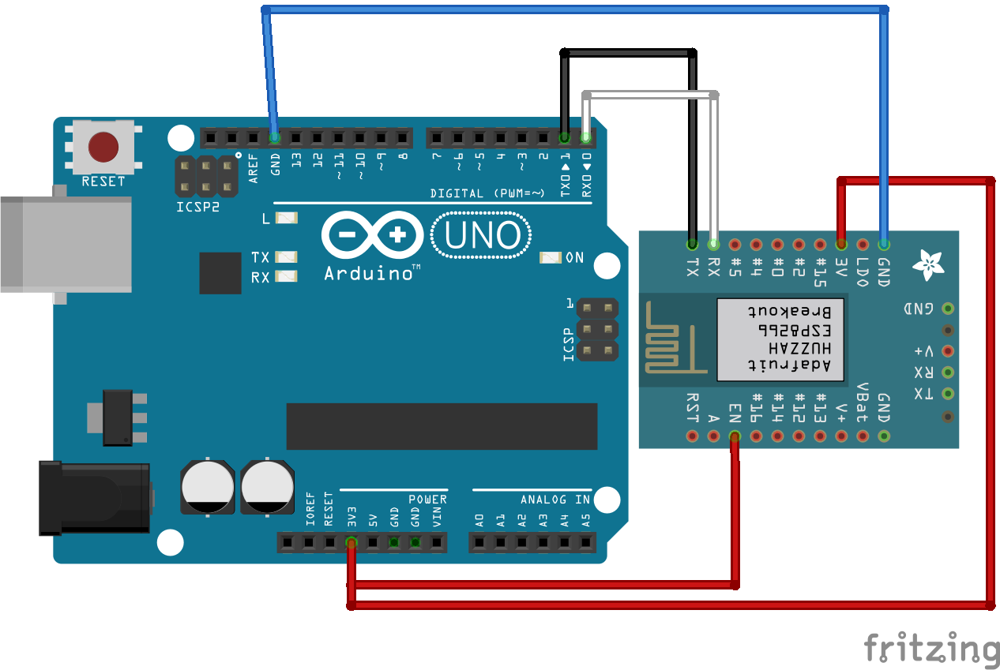
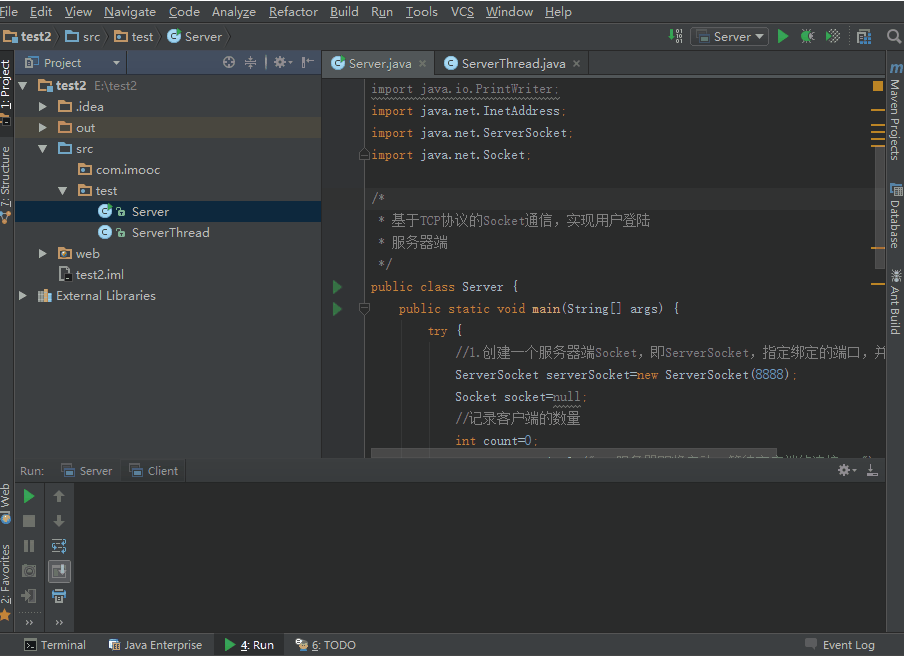
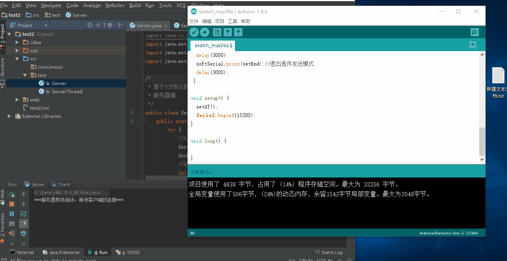

[参考文献](https://blog.csdn.net/Jsagacity/article/details/79591807)

总操做流程：
- 1、各器件链接;
- 2、用Java写服务器程序;
- 3、arduino写程序;
- 4、测试;

----------

# 各器件链接;

# 用Java写服务器程序
### 1、Server
```
package test;

import java.io.BufferedReader;
import java.io.IOException;
import java.io.InputStream;
import java.io.InputStreamReader;
import java.io.OutputStream;
import java.io.PrintWriter;
import java.net.InetAddress;
import java.net.ServerSocket;
import java.net.Socket;

/*
 * 基于TCP协议的Socket通信，实现用户登陆
 * 服务器端
 */
public class Server {
	public static void main(String[] args) {
		try {
			//1.创建一个服务器端Socket，即ServerSocket，指定绑定的端口，并监听此端口
			ServerSocket serverSocket=new ServerSocket(8888);
			Socket socket=null;
			//记录客户端的数量
			int count=0;
			System.out.println("***服务器即将启动，等待客户端的连接***");
			//循环监听等待客户端的连接
			while(true){
				//调用accept()方法开始监听，等待客户端的连接
				socket=serverSocket.accept();
				//创建一个新的线程
				ServerThread serverThread=new ServerThread(socket);
				//启动线程
				serverThread.start();

				count++;//统计客户端的数量
				System.out.println("客户端的数量："+count);
				InetAddress address=socket.getInetAddress();
				System.out.println("当前客户端的IP："+address.getHostAddress());
			}
		} catch (IOException e) {
			e.printStackTrace();
		}
	}
}

```
### 2、ServerThread
```
package test;

import java.io.BufferedReader;
import java.io.IOException;
import java.io.InputStream;
import java.io.InputStreamReader;
import java.io.OutputStream;
import java.io.PrintWriter;
import java.net.Socket;
import java.util.Scanner;

/*
 * 服务器线程处理类
 */
public class ServerThread extends Thread {
	// 和本线程相关的Socket
	Socket socket = null;

	public ServerThread(Socket socket) {
		this.socket = socket;
	}

	//线程执行的操作，响应客户端的请求
	public void run(){
		InputStream is=null;
		InputStreamReader isr=null;
		BufferedReader br=null;
		OutputStream os=null;
		PrintWriter pw=null;
		try {
			//获取输入流，并读取客户端信息
			is = socket.getInputStream();
			isr = new InputStreamReader(is);
			br = new BufferedReader(isr);
			String info=null;

			//获取输出流，响应客户端的请求
			os = socket.getOutputStream();
			pw = new PrintWriter(os);

			while((info=br.readLine())!=null){//循环读取客户端的信息
				System.out.println("我是服务器，客户端说："+info);


				Scanner sc=new Scanner(System.in);
				System.out.println("我是服务器，我对客户端说：");
				String s1=sc.nextLine();
				pw.write(s1);
				pw.flush();//调用flush()方法将缓冲输出
			}
			socket.shutdownInput();//关闭输入流
		} catch (IOException e) {
			// TODO Auto-generated catch block
			e.printStackTrace();
		}finally{
			//关闭资源
			try {
				if(pw!=null)
					pw.close();
				if(os!=null)
					os.close();
				if(br!=null)
					br.close();
				if(isr!=null)
					isr.close();
				if(is!=null)
					is.close();
				if(socket!=null)
					socket.close();
			} catch (IOException e) {
				e.printStackTrace();
			}
		}
	}
}

```
运行：

# arduino写程序
```
#include <SoftwareSerial.h>
SoftwareSerial softSerial(1, 0);//RX=1 TX=2

 /**
 * 写AT命令，连接服务器
 */
  void setAT(){
  softSerial.println("AT+CWMODE=1");//将8266设置为STA模式
  delay(3000);
  softSerial.println("AT+RST");//设置完之后重启
  delay(3000);
  softSerial.println("AT+CWJAP=\"WE-178\",\"AbCe@163.com~*~");//8266连接路由器发出的WiFi
  delay(3000);
  softSerial.println("AT+CIPMUX=0");//启动多连接
  delay(3000);
  softSerial.println("AT+CIPSTART=\"TCP\",\"192.168.0.103\",8888");//通过协议、IP和端口连接服务器
  delay(3000);
  softSerial.println("AT+CIPMODE=1");//设置透传
  delay(3000);
  softSerial.println("AT+CIPSEND");//启动发送
  delay(3000);
  softSerial.println("Connection Successful");//发送数据
  delay(3000);
  softSerial.print("+++");//退出
  delay(3000);
 }

void setup() {
  softSerial.begin(115200);
  setAT();
  Serial.begin(115200);
}

void loop() {

}
```
# 测试

