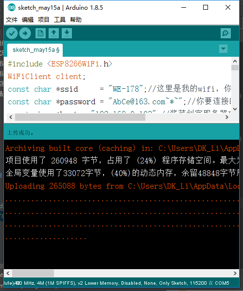
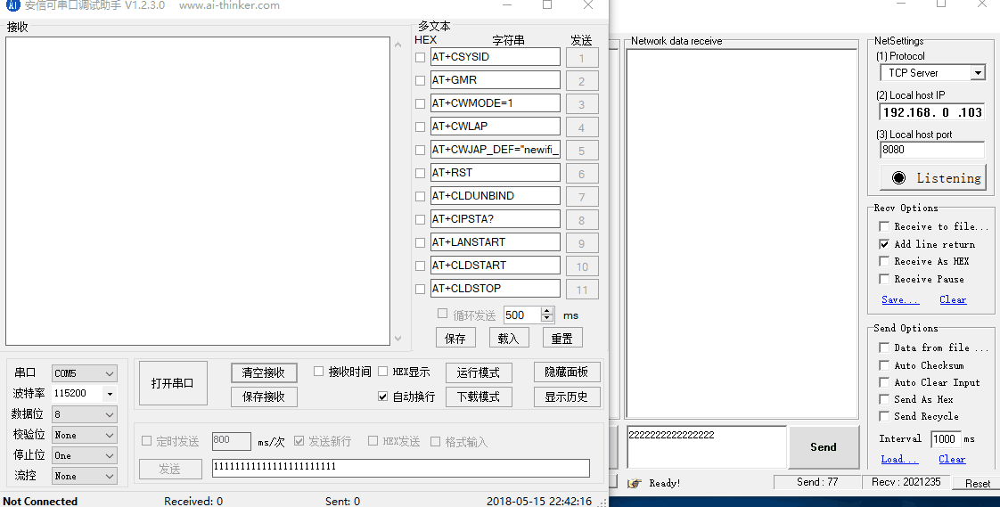

[参考文献](http://www.geek-workshop.com/thread-27930-1-1.html)
总操作流程：
- 1、烧写程序；
- 2、测试；

***
# 烧写程序
```
#include <ESP8266WiFi.h>
WiFiClient client;
const char *ssid     = "WE-178";//这里是我的wifi，你使用时修改为你要连接的wifi ssid
const char *password = "AbCe@163.com~*~";//你要连接的wifi密码
const char *host = "192.168.0.103";//酱菜创客服务器IP
const int httpPort =8080;//端口号
String line ="";
void setup() {
  Serial.begin(115200);
  delay(10);
  Serial.print("Connecting to ");
  Serial.println(ssid);
  WiFi.begin(ssid, password);
  while (WiFi.status() != WL_CONNECTED) {
    delay(500);
    Serial.print(".");
  }
  Serial.println("");
  Serial.println("WiFi connected");
  Serial.println("IP address: ");
  Serial.println(WiFi.localIP());
  while (!client.connect(host, httpPort)) {
    Serial.println("connection failed");
    delay(500);
  }
  Serial.print("connecting to ");
  Serial.println(host);
  client.write("successfully\r\n");//绑定apikey,修改成你自己的apikey
  delay(10);
}

void loop() {
  while(client.available()){
    String line = client.readStringUntil('\r');
     Serial.println(line);
  }
  while(Serial.available()){
    String line = Serial.readStringUntil('\r');
    client.println(line);
  }

}
```

# 测试
