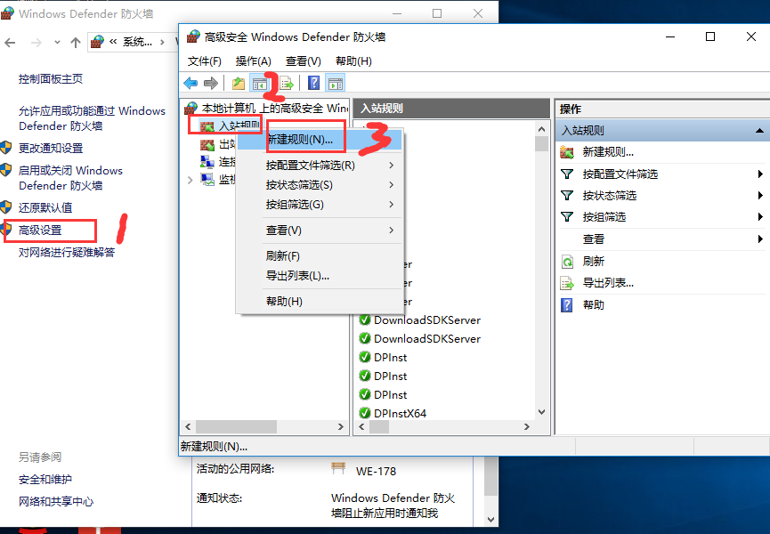
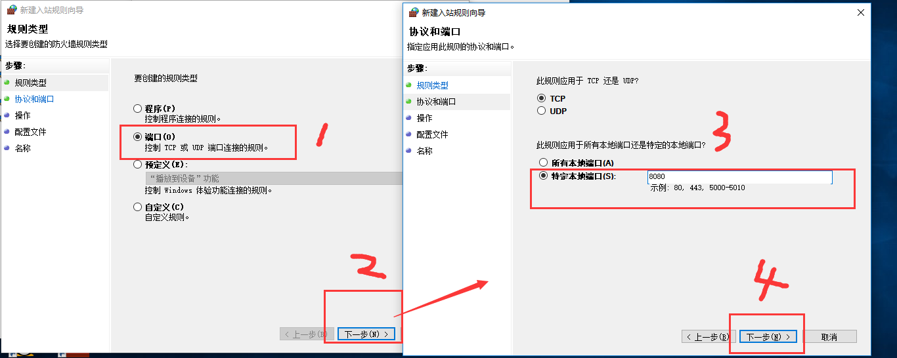
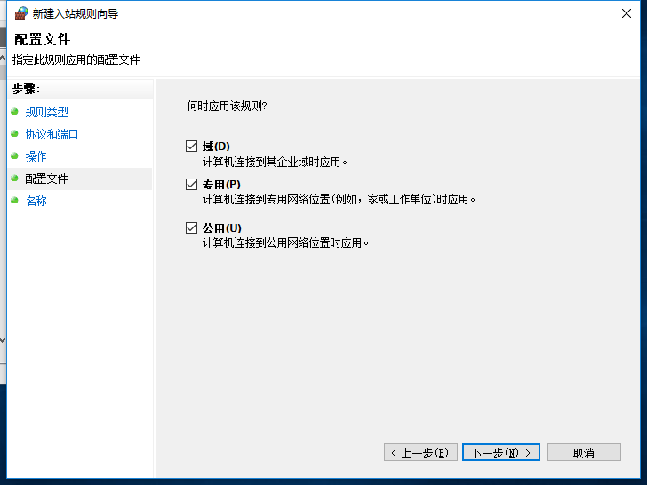
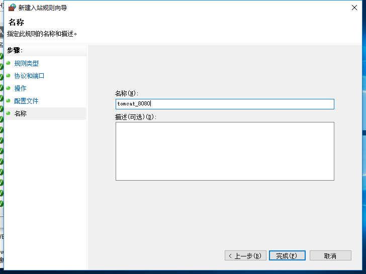
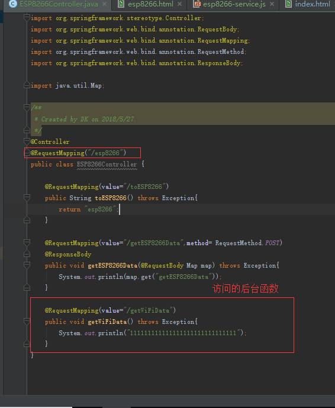
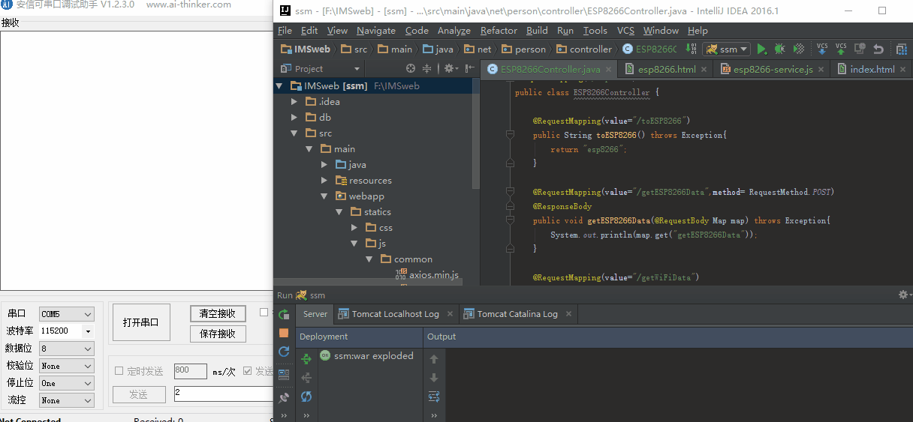

总操作流程：
- 1、关闭对tomcat的防火墙；
- 2、运行Javaweb项目；
- 3、烧录代码到WiFiduino;
- 4、测试；

***

# 关闭对tomcat的防火墙









# 运行Javaweb项目


# 烧录代码到WiFiduino

```
#include <ESP8266WiFi.h>
WiFiClient client;
const char *ssid     = "WE-178";//这里是我的wifi，你使用时修改为你要连接的wifi ssid
const char *password = "123456789o";//你要连接的wifi密码
const char *host = "192.168.0.90";//服务器IP
const int httpPort =8080;//端口号
const String url = "/esp8266/getWiFiData";   // 需要访问的地址
String line ="";
void setup() {
  Serial.begin(115200);
  delay(10);
  Serial.print("Connecting to ");
  Serial.println(ssid);
  WiFi.begin(ssid, password);
  while (WiFi.status() != WL_CONNECTED) {
    delay(500);
    Serial.print(".");
  }
  Serial.println("");
  Serial.println("WiFi connected");
  Serial.println("IP address: ");
  Serial.println(WiFi.localIP());
  while (!client.connect(host, httpPort)) {
    Serial.println("connection failed");
    delay(500);
  }
  Serial.print("connecting to ");
  Serial.println(host);
  Serial.write("successfully\r\n");//绑定apikey,修改成你自己的apikey
  delay(10);
  requestGetWiFiData();
}

void loop() {
  while(client.available()){
    String line = client.readStringUntil('\r');
     Serial.println(line);
  }
  while(Serial.available()){
    String line = Serial.readStringUntil('\r');
    client.println(line);
  }
}
/**
 * 访问后台的方法
 */
 void requestGetWiFiData(){
   String postRequest =String("GET ") + url + " HTTP/1.1\r\n" +
               "Host: " + host + "\r\n" +
               "User-Agent: BuildFailureDetectorESP8266\r\n" +
               "Connection: close\r\n\r\n";  
  client.print(postRequest);  // 发送HTTP请求 
}
```
# 测试
