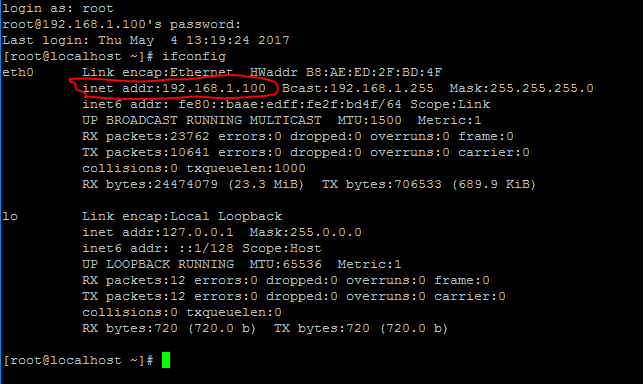

总操作流程：
- 1、[下载工具](#Linux-01)
- 2、[获取服务器的ip](#Linux-02)
- 3、[使用工具远程控制](#Linux-03)

----------

# <a name="Linux-01" href="#" >下载工具</a>

下载putty：
[](https://pan.baidu.com/s/1T4UYILhzdwoWqkfCINvXgQ)
或者下载Xmanager Enterprise 5：
[](https://pan.baidu.com/s/13BdHO9Eev2-15rmthagHJw)

# <a name="Linux-02" href="#" >获取服务器的ip</a>

获取服务器的ip：
```
命令：ifconfig
```


# <a name="Linux-03" href="#" >使用工具远程控制</a>

putty的使用教程：
[](http://www.runoob.com/linux/linux-remote-login.html)


使用XShell的教程：
[](http://www.cnblogs.com/perseverancevictory/p/4910145.html)


设置ip地址教程
[](http://www.linuxidc.com/Linux/2015-01/111265.htm)

设置ssh的教程：
