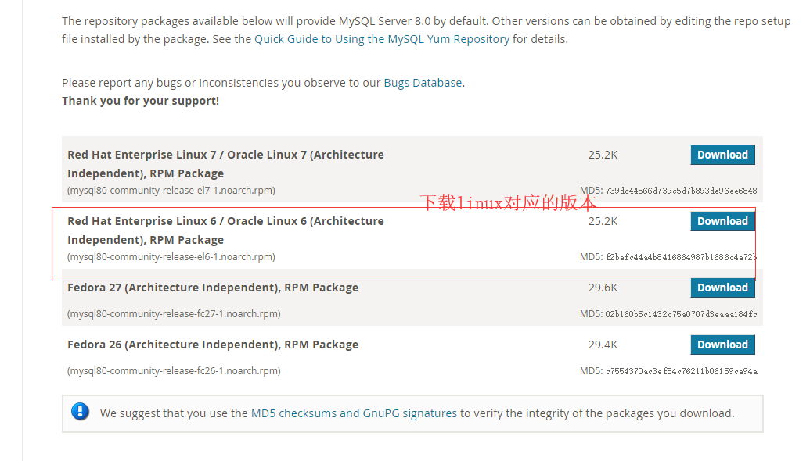

[参考文献](https://blog.csdn.net/wz1226864411/article/details/76146180)

总操作流程：
- 1、删除系统自带的mysql；
- 2、下载安装mysql；
- 3、配置mysql；

----------

# 删除系统自带的mysql
```
yum list installed mysql* #看是否安装过mysql

yum remove 文件名 #卸载mysql
```
# 下载安装mysql(CentOS 6)
### 1、下载
```
uname -r #查看系统版本
```

### 2、上传
```
su #切换到root，输入密码进入

chmod  0777 /usr/local #给目录写入权限

mkdir mysql #创建目录

chmod  0777 /usr/local/mysql #给目录写入权限
```

### 3、安装
`安装顺序：common --> libs --> clients --> server`
```
ls 

#安装
rpm -ivh mysql-community-common-8.0.11-1.el6.x86_64.rpm
rpm -ivh mysql-community-libs-8.0.11-1.el6.x86_64.rpm
rpm -ivh mysql-community-client-8.0.11-1.el6.x86_64.rpm
rpm -ivh mysql-community-server-8.0.11-1.el6.x86_64.rpm

rpm -qa | grep mysql #查看mysql是否安装上
```
# 配置mysql
```
[mysqld]
skip-grant-tables
```

````
service mysqld restart #重启MySQL服务
````
