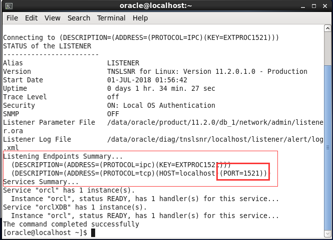
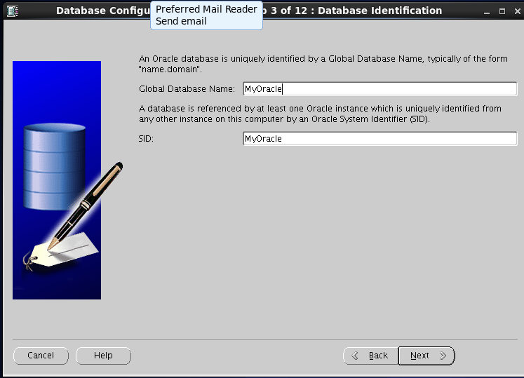
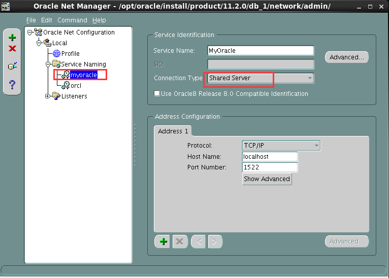
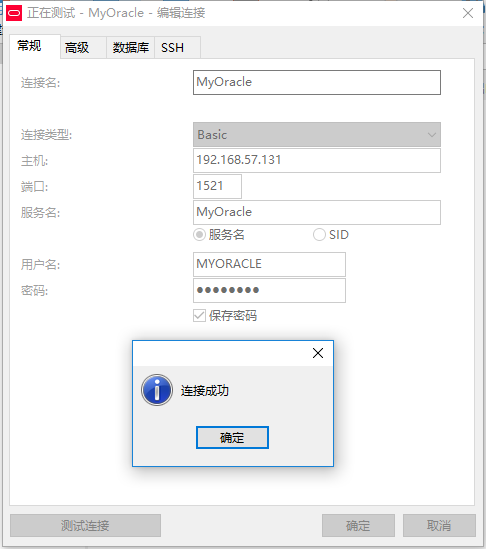

总操作流程：
- 1、获取Oracle的端口号；
- 2、创建一个远程用户，并赋予权限；
- 3、设置防火墙；
- 4、测试；

***

# 获取Oracle的端口号
```
lsnrctl status #查看监听器的状态
```


# 创建一个远程用户，并赋予权限
### 1、创建用户，并赋予权限
```
su dk

sqlplus / as sysdba;

conn /as sysdba;

create user MYORACLE identified by "123456";  # 创建用户

 # 赋予权限
grant  connect,resource,dba,create session,create any table,select any dictionary to MYORACLE;

alter user MYORACLE account unlock;

connect MYORACLE/123456; #测试是否创建成功
```
### 2、创建数据库
```
dbca
```
- Oracle图形界面选项展现关键步骤其他的默认




### 3、给数据库实例外连接设置
```
netmgr
```

### 4、切换到MyOracle数据库实例名
```
export ORACLE_SID=MyOracle

sqlplus / as sysdba; #进入数据

startup #开启oracle

alter system register; #手工强制将数据库实例注册到监听

exit #退出数据库

lsnrctl reload  #重启监听

lsnrctl status #查看监听状态

```
# 设置防火墙
```
su

vi  /etc/sysconfig/iptables #打开防火墙配置文件

```
- 添加内容：
`注意：增加的开放3306端口的语句一定要在icmp-host-prohibited之前`

```
-A INPUT -m state --state NEW -m tcp -p tcp --dport 1521 -j ACCEPT
```
- 重启防火墙
```
service  iptables restart #重启防火墙
```
# 测试

