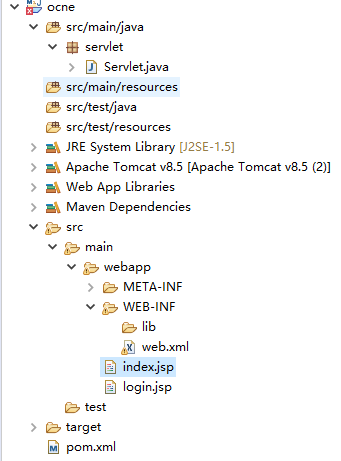

操作总流程：
- 1、修改pom.xml文件，添加servlet依赖
- 2、新建一个Servlet
- 3、修改Web.xml
- 4、创建index.jsp
- 5、创建login.jsp

----------


# 在pom.xml添加需要的jar的配置
（http://www.mvnrepository.com/search?q=servlet这里找）


# 新建一个Servlet

```
package servlet;

import java.io.IOException;
import javax.servlet.ServletException;
import javax.servlet.http.HttpServlet;
import javax.servlet.http.HttpServletRequest;
import javax.servlet.http.HttpServletResponse;

/**
 * Servlet implementation class ServletDemo
 */
public class Servlet extends HttpServlet {
    private static final long serialVersionUID = 1L;
       
    public Servlet() {
        super();
    }

    protected void doGet(HttpServletRequest request, HttpServletResponse response) throws ServletException, IOException {
        doPost(request, response);
    }

    protected void doPost(HttpServletRequest request, HttpServletResponse response) throws ServletException, IOException {
        request.setCharacterEncoding("UTF-8");  
        response.setContentType("text/html;charset=utf-8");
        
        String action = request.getParameter("action");  
        if("login_input".equals(action)) {  
            request.getRequestDispatcher("login.jsp").forward(request , response);  
        } else if("login".equals(action)) {  
            String name = request.getParameter("name");  
            String password = request.getParameter("password");  
              
            System.out.println("name->" + name + ",password->" + password);
        }
    }

}

```
# 修改Web.xml
```
<?xml version="1.0" encoding="UTF-8"?>
<web-app xmlns:javaee="http://java.sun.com/xml/ns/javaee" xmlns:web="http://java.sun.com/xml/ns/javaee/web-app_2_5.xsd">
  <javaee:display-name>Archetype Created Web Application</javaee:display-name>
  <servlet>
    <javaee:description></javaee:description>
    <javaee:display-name>Servlet</javaee:display-name>
    <servlet-name>Servlet</servlet-name>
    <servlet-class>servlet.Servlet</servlet-class>
  </servlet>
  <servlet-mapping>
    <servlet-name>Servlet</servlet-name>
    <url-pattern>/demo</url-pattern>
  </servlet-mapping>
</web-app>
```
# 创建index.jsp
```
<%@ page language="java" contentType="text/html; charset=UTF-8"
    pageEncoding="UTF-8"%>
<!DOCTYPE html PUBLIC "-//W3C//DTD HTML 4.01 Transitional//EN" "http://www.w3.org/TR/html4/loose.dtd">
<html>
<head>
<meta http-equiv="Content-Type" content="text/html; charset=UTF-8">
<title>Insert title here</title>
</head>
<body>
    <p>用Maven创建web项目，测试Servlet</p>
    <a href="demo?action=login_input">登录(demo?action=login_input)</a>
</body>
</html>
```
# 创建login.jsp
```
<%@ page language="java" contentType="text/html; charset=UTF-8"
    pageEncoding="UTF-8"%>
<!DOCTYPE html PUBLIC "-//W3C//DTD HTML 4.01 Transitional//EN" "http://www.w3.org/TR/html4/loose.dtd">
<html>
<head>
<meta http-equiv="Content-Type" content="text/html; charset=UTF-8">
<title>Insert title here</title>
</head>
<body>
    <form action="demo?action=login" method="post">  
        Name:<input type="text" name="name" />  
        Password:<input type="password" name="password" />  
              
        <input type="submit" value="登录" />  
    </form>  
</body>
</html>
```
