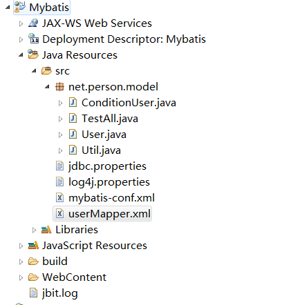

总操做流程：
- 1、数据库；
- 2、ConditionUser；
- 3、User；
- 4、Util；
- 5、TestAll；
- 6、jdbc.properties；
- 7、log4j.properties；
- 8、userMapper.xml；

----------




# 数据库
```
create table d_user(  
	id int primary key auto_increment,  
	name varchar(10),
	age int(3)
); 

insert into d_user(name,age) values('Tom',12);  
insert into d_user(name,age) values('Bob',13);  
insert into d_user(name,age) values('Jack',18);

```
# ConditionUser
```
package net.person.model;

public class ConditionUser {
	private String name;
	private int minAge;
	private int maxAge;
	public ConditionUser(String name, int minAge, int maxAge) {
		super();
		this.name = name;
		this.minAge = minAge;
		this.maxAge = maxAge;
	}
	public ConditionUser() {
		super();
	}
	public String getName() {
		return name;
	}
	public void setName(String name) {
		this.name = name;
	}
	public int getMinAge() {
		return minAge;
	}
	public void setMinAge(int minAge) {
		this.minAge = minAge;
	}
	public int getMaxAge() {
		return maxAge;
	}
	public void setMaxAge(int maxAge) {
		this.maxAge = maxAge;
	}
	@Override
	public String toString() {
		return "ConditionUser [name=" + name + ", minAge=" + minAge + ", maxAge=" + maxAge + "]";
	}
	

}

```
# User
```
package net.person.model;

public class User {
	private int id;
	private String name;
	private int age;
	public User(int id, String name, int age) {
		super();
		this.id = id;
		this.name = name;
		this.age = age;
	}
	public User() {
		super();
	}
	public int getId() {
		return id;
	}
	public void setId(int id) {
		this.id = id;
	}
	public String getName() {
		return name;
	}
	public void setName(String name) {
		this.name = name;
	}
	public int getAge() {
		return age;
	}
	public void setAge(int age) {
		this.age = age;
	}
	@Override
	public String toString() {
		return "User [id=" + id + ", name=" + name + ", age=" + age + "]";
	}

}

```
# Util
```
package net.person.model;

import java.io.InputStream;

import org.apache.ibatis.session.SqlSessionFactory;
import org.apache.ibatis.session.SqlSessionFactoryBuilder;

public class Util {
	public static SqlSessionFactory getFactory(){
		String resource = "mybatis-conf.xml"; 
		//加载mybatis的配置文件（它也加载关联的映射文件）
		InputStream is = Util.class.getClassLoader().getResourceAsStream(resource); 
		//构建sqlSession的工厂
		SqlSessionFactory factory = new SqlSessionFactoryBuilder().build(is);
		return factory;
	}
}

```
# TestAll
```
package net.person.model;

import java.util.List;

import org.apache.ibatis.session.SqlSession;
import org.apache.ibatis.session.SqlSessionFactory;
import org.junit.Test;


public class TestAll {
	/**
	 * 查询数据
	 */
	@Test
	public void testClasses() {
		SqlSessionFactory factory=Util.getFactory();
		SqlSession session = factory.openSession();
		//映射sql的标识字符串
		String statement = "userMapper.getUser";
		String name = "o";
		
		ConditionUser parameter = new ConditionUser("%"+name+"%",13,18);
		List<User> list = session.selectList(statement, parameter);
		
		System.out.println(list);
		//提交
		session.commit();
		session.close();
	}
}

```
# jdbc.properties
```
#mysql
jdbc.driver=com.mysql.jdbc.Driver
jdbc.url=jdbc:mysql://localhost:3306/mybatis
jdbc.username=root
jdbc.password=123456
```
# log4j.properties
```
log4j.rootLogger=CONSOLE,FILE  
log4j.addivity.org.apache=true  
  
# 应用于控制台  
log4j.appender.CONSOLE=org.apache.log4j.ConsoleAppender  
log4j.appender.CONSOLE.Threshold=INFO  
log4j.appender.CONSOLE.Target=System.out  
log4j.appender.CONSOLE.Encoding=GBK
log4j.appender.CONSOLE.layout=org.apache.log4j.PatternLayout  
log4j.appender.CONSOLE.layout.ConversionPattern=[framework] %d - %c -%-4r [%t] %-5p %c %x - %m%n  
  
# 每天新建日志  
log4j.appender.A1=org.apache.log4j.DailyRollingFileAppender  
log4j.appender.A1.File=C:/log4j/log  
log4j.appender.A1.Encoding=GBK
log4j.appender.A1.Threshold=DEBUG  
log4j.appender.A1.DatePattern='.'yyyy-MM-dd  
log4j.appender.A1.layout=org.apache.log4j.PatternLayout  
log4j.appender.A1.layout.ConversionPattern=%d{ABSOLUTE} %5p %c{1}:%L : %m%n  
  
#应用于文件  
log4j.appender.FILE=org.apache.log4j.FileAppender  
log4j.appender.FILE.File=C:/log4j/file.log  
log4j.appender.FILE.Append=false  
log4j.appender.FILE.Encoding=GBK
log4j.appender.FILE.layout=org.apache.log4j.PatternLayout  
log4j.appender.FILE.layout.ConversionPattern=[framework] %d - %c -%-4r [%t] %-5p %c %x - %m%n  
  
# 应用于文件回滚  
log4j.appender.ROLLING_FILE=org.apache.log4j.RollingFileAppender  
log4j.appender.ROLLING_FILE.Threshold=ERROR  
log4j.appender.ROLLING_FILE.File=rolling.log  
log4j.appender.ROLLING_FILE.Append=true  
log4j.appender.CONSOLE_FILE.Encoding=GBK
log4j.appender.ROLLING_FILE.MaxFileSize=10KB  
log4j.appender.ROLLING_FILE.MaxBackupIndex=1  
log4j.appender.ROLLING_FILE.layout=org.apache.log4j.PatternLayout  
log4j.appender.ROLLING_FILE.layout.ConversionPattern=[framework] %d - %c -%-4r [%t] %-5p %c %x - %m%n  
  
#自定义Appender  
log4j.appender.im = net.cybercorlin.util.logger.appender.IMAppender  
log4j.appender.im.host = mail.cybercorlin.net  
log4j.appender.im.username = username  
log4j.appender.im.password = password  
log4j.appender.im.recipient = yyflyons@163.com  
log4j.appender.im.layout=org.apache.log4j.PatternLayout  
log4j.appender.im.layout.ConversionPattern =[framework] %d - %c -%-4r [%t] %-5p %c %x - %m%n  
  
#应用于socket  
log4j.appender.SOCKET=org.apache.log4j.RollingFileAppender  
log4j.appender.SOCKET.RemoteHost=localhost  
log4j.appender.SOCKET.Port=5001  
log4j.appender.SOCKET.LocationInfo=true  
# Set up for Log Facter 5  
log4j.appender.SOCKET.layout=org.apache.log4j.PatternLayout  
log4j.appender.SOCET.layout.ConversionPattern=[start]%d{DATE}[DATE]%n%p[PRIORITY]%n%x[NDC]%n%t[THREAD]%n%c[CATEGORY]%n%m[MESSAGE]%n%n  
# Log Factor 5 Appender  
log4j.appender.LF5_APPENDER=org.apache.log4j.lf5.LF5Appender  
log4j.appender.LF5_APPENDER.MaxNumberOfRecords=2000  
  
# 发送日志给邮件  
log4j.appender.MAIL=org.apache.log4j.net.SMTPAppender  
log4j.appender.MAIL.Threshold=FATAL  
log4j.appender.MAIL.BufferSize=10  
log4j.appender.MAIL.From=yyflyons@163.com  
log4j.appender.MAIL.SMTPHost=www.wusetu.com  
log4j.appender.MAIL.Subject=Log4J Message  
log4j.appender.MAIL.To=yyflyons@126.com  
log4j.appender.MAIL.layout=org.apache.log4j.PatternLayout  
log4j.appender.MAIL.layout.ConversionPattern=[framework] %d - %c -%-4r [%t] %-5p %c %x - %m%n  
# 打印出sql
log4j.logger.java.sql.Connection=DEBUG
log4j.logger.java.sql.ResultSet=DEBUG
log4j.logger.java.sql.PreparedStatement=DEBUG
log4j.logger.java.sql.Statement=DEBUG 

```
# mybatis-conf.xml
```
<?xml version="1.0" encoding="UTF-8"?>
<!DOCTYPE configuration PUBLIC "-//mybatis.org//DTD Config 3.0//EN" "http://mybatis.org/dtd/mybatis-3-config.dtd">
<configuration>
	<!-- 链接数据库配置文件 -->
	<properties resource="jdbc.properties"></properties>
	
	<!-- 配置实体类的别名 -->
	<typeAliases>
		<package name="net.person.model"/>
	</typeAliases>
	
	 <environments default="development">
        <environment id="development">
            <transactionManager type="JDBC" />
            <dataSource type="POOLED">
                <property name="driver" value="${jdbc.driver}" />
                <property name="url" value="${jdbc.url}" />
                <property name="username" value="${jdbc.username}" />
                <property name="password" value="${jdbc.password}" />
            </dataSource>
        </environment>
    </environments>
	
	<mappers>
		<mapper resource="userMapper.xml"/>
	</mappers>
	

</configuration>

```
# userMapper.xml
```
<?xml version="1.0" encoding="UTF-8"?>
<!DOCTYPE mapper PUBLIC "-//mybatis.org//DTD Mapper 3.0//EN" "http://mybatis.org/dtd/mybatis-3-mapper.dtd"> 
<mapper namespace="userMapper">
	<!-- 
	实现多条件查询用户(姓名模糊匹配, 年龄在指定的最小值到最大值之间)
	 -->
	<select id="getUser" parameterType="ConditionUser" resultType="User">
		select * from d_user where 
		<if test='name != "%null%"'>
			 name like #{name} and 
		</if>
		age between #{minAge} and #{maxAge}
	</select>
</mapper>
```