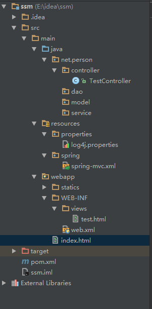
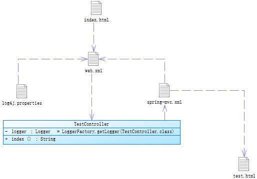

总操作流程：
- 1、[在pom.xml配置需要的架包](#java-01)
- 2、[创建log4j.properties文件](#java-02)
- 3、[创建spring-mvc.xml文件](#java-03)
- 4、[配置web.xml文件](#java-04)
- 5、[创建TestController的Java文件](#java-05)
- 6、[创建test.html文件](#java-06)
- 7、[修改index.html文件](#java-07)

[](https://github.com/lidekai/idea-maven-spring-springMVC.git)


----------
- 项目目录结构



- 代码结构


# <a name="java-01" href="#" >在pom.xml配置需要的架包</a>
```
  <!--
      版本设置
-->
  <properties>
    <junit.version>3.8.1</junit.version><!--junit-->
    <spring.version>4.0.4.RELEASE</spring.version><!--spring-->
    <log4j12.version>1.7.21</log4j12.version><!--log4j12-->
    <commonsLang3.version>3.4</commonsLang3.version><!--commons-lang3-->
    <commonsFileupload.version>1.3.1</commonsFileupload.version><!--commons-fileupload-->
    <jstl.version>1.2</jstl.version><!--jstl-->
    <standard.version>1.1.2</standard.version><!--standard-->
  </properties>

  <!--
          导入的包
    -->
  <dependencies>

    <!--=====================================junit=====================================-->
    <dependency>
      <groupId>junit</groupId>
      <artifactId>junit</artifactId>
      <version>${junit.version}</version>
      <scope>test</scope>
    </dependency>
    <!--=====================================log4j12=====================================-->
    <dependency>
      <groupId>org.slf4j</groupId>
      <artifactId>slf4j-log4j12</artifactId>
      <version>${log4j12.version}</version>
    </dependency>

    <!--=====================================spring=====================================-->
    <dependency>
      <groupId>org.springframework</groupId>
      <artifactId>spring-aop</artifactId>
      <version>${spring.version}</version>
    </dependency>
    <dependency>
      <groupId>org.springframework</groupId>
      <artifactId>spring-aspects</artifactId>
      <version>${spring.version}</version>
    </dependency>
    <dependency>
      <groupId>org.springframework</groupId>
      <artifactId>spring-beans</artifactId>
      <version>${spring.version}</version>
    </dependency>
    <dependency>
      <groupId>org.springframework</groupId>
      <artifactId>spring-context</artifactId>
      <version>${spring.version}</version>
    </dependency>
    <dependency>
      <groupId>org.springframework</groupId>
      <artifactId>spring-context-support</artifactId>
      <version>${spring.version}</version>
    </dependency>
    <dependency>
      <groupId>org.springframework</groupId>
      <artifactId>spring-core</artifactId>
      <version>${spring.version}</version>
    </dependency>
    <dependency>
      <groupId>org.springframework</groupId>
      <artifactId>spring-expression</artifactId>
      <version>${spring.version}</version>
    </dependency>
    <dependency>
      <groupId>org.springframework</groupId>
      <artifactId>spring-jdbc</artifactId>
      <version>${spring.version}</version>
    </dependency>
    <dependency>
      <groupId>org.springframework</groupId>
      <artifactId>spring-orm</artifactId>
      <version>${spring.version}</version>
    </dependency>
    <dependency>
      <groupId>org.springframework</groupId>
      <artifactId>spring-test</artifactId>
      <version>${spring.version}</version>
    </dependency>
    <dependency>
      <groupId>org.springframework</groupId>
      <artifactId>spring-tx</artifactId>
      <version>${spring.version}</version>
    </dependency>
    <dependency>
      <groupId>org.springframework</groupId>
      <artifactId>spring-web</artifactId>
      <version>${spring.version}</version>
    </dependency>
    <dependency>
      <groupId>org.springframework</groupId>
      <artifactId>spring-webmvc</artifactId>
      <version>${spring.version}</version>
    </dependency>
    <!--=====================================standard=====================================-->
    <dependency>
      <groupId>taglibs</groupId>
      <artifactId>standard</artifactId>
      <version>${standard.version}</version>
    </dependency>
    <!--=====================================jstl=====================================-->
    <dependency>
      <groupId>javax.servlet</groupId>
      <artifactId>jstl</artifactId>
      <version>${jstl.version}</version>
    </dependency>
    <!--=====================================其他需要的包=====================================-->
    <dependency>
      <groupId>org.apache.commons</groupId>
      <artifactId>commons-lang3</artifactId>
      <version>${commonsLang3.version}</version>
    </dependency>
    <dependency>
      <groupId>commons-fileupload</groupId>
      <artifactId>commons-fileupload</artifactId>
      <version>${commonsFileupload.version}</version>
    </dependency>

  </dependencies>
```

# <a name="java-02" href="#" >创建log4j.properties文件</a>
```
#配置根Logger 后面是若干个Appender
log4j.rootLogger=DEBUG,A1,R
#log4j.rootLogger=INFO,A1,R

# ConsoleAppender 输出
log4j.appender.A1=org.apache.log4j.ConsoleAppender
log4j.appender.A1.layout=org.apache.log4j.PatternLayout
log4j.appender.A1.layout.ConversionPattern=%-d{yyyy-MM-dd HH:mm:ss,SSS} [%c]-[%p] %m%n

# File 输出 一天一个文件,输出路径可以定制,一般在根路径下
log4j.appender.R=org.apache.log4j.DailyRollingFileAppender
log4j.appender.R.File=log.txt
log4j.appender.R.MaxFileSize=500KB
log4j.appender.R.MaxBackupIndex=10
log4j.appender.R.layout=org.apache.log4j.PatternLayout
log4j.appender.R.layout.ConversionPattern=%d{yyyy-MM-dd HH:mm:ss,SSS} [%t] [%c] [%p] - %m%n
```
# <a name="java-03" href="#" >创建spring-mvc.xml文件</a>
```
<?xml version="1.0" encoding="UTF-8"?>
<beans xmlns="http://www.springframework.org/schema/beans"
       xmlns:xsi="http://www.w3.org/2001/XMLSchema-instance"
       xmlns:context="http://www.springframework.org/schema/context"
       xmlns:mvc="http://www.springframework.org/schema/mvc"
       xsi:schemaLocation="http://www.springframework.org/schema/beans
                        http://www.springframework.org/schema/beans/spring-beans-3.2.xsd
                         http://www.springframework.org/schema/context
                        http://www.springframework.org/schema/context/spring-context-3.2.xsd
                        http://www.springframework.org/schema/mvc
                        http://www.springframework.org/schema/mvc/spring-mvc.xsd">
    <!--启用spring的一些annotation -->
    <context:annotation-config/>

    <!-- 自动扫描该包，使SpringMVC认为包下用了@controller注解的类是控制器 -->
    <context:component-scan base-package="net.person.controller">
        <context:include-filter type="annotation" expression="org.springframework.stereotype.Controller"/>
    </context:component-scan>

    <!--HandlerMapping 无需配置，springmvc可以默认启动-->

    <!--静态资源映射-->
    <!--本项目把静态资源放在了WEB-INF的statics目录下，资源映射如下-->
    <mvc:resources mapping="/css/**" location="/statics/css/"/>
    <mvc:resources mapping="/js/**" location="/statics/js/"/>
    <mvc:resources mapping="/image/**" location="/statics/image/"/>


    <!-- 配置注解驱动 可以将request参数与绑定到controller参数上 -->
    <mvc:annotation-driven/>

    <!-- 对模型视图名称的解析，即在模型视图名称添加前后缀(如果最后一个还是表示文件夹,则最后的斜杠不要漏了) 使用JSP-->
    <!-- 默认的视图解析器 在上边的解析错误时使用 (默认使用html)- -->
    <bean id="defaultViewResolver" class="org.springframework.web.servlet.view.InternalResourceViewResolver">
        <property name="viewClass" value="org.springframework.web.servlet.view.JstlView"/>
        <property name="prefix" value="/WEB-INF/views/"/><!--设置JSP文件的目录位置-->
        <property name="suffix" value=".html"/>
    </bean>

    <!-- springmvc文件上传需要配置的节点-->
    <bean id="multipartResolver" class="org.springframework.web.multipart.commons.CommonsMultipartResolver">
        <property name="maxUploadSize" value="20971500"/>
        <property name="defaultEncoding" value="UTF-8"/>
        <property name="resolveLazily" value="true"/>
    </bean>
</beans>
```
# <a name="java-04" href="#" >配置web.xml文件</a>
```
<?xml version="1.0" encoding="UTF-8"?>
<web-app xmlns:xsi="http://www.w3.org/2001/XMLSchema-instance"
         xmlns="http://java.sun.com/xml/ns/javaee"
         xsi:schemaLocation="http://java.sun.com/xml/ns/javaee http://java.sun.com/xml/ns/javaee/web-app_3_0.xsd"
         version="3.0">
  <!-- 加載順序: 上下文参数  >>> 监听器  >>> 过滤器  >>> 拦截器  -->
  <display-name>Archetype Created Web Application</display-name>

  <welcome-file-list>
    <welcome-file>index.html</welcome-file>
  </welcome-file-list>

  <servlet-mapping>
    <servlet-name>default</servlet-name>
    <url-pattern>*.html</url-pattern>
  </servlet-mapping>

  <!-- 根应用上下文配置 -->
  <context-param>
    <param-name>contextClass</param-name>
    <param-value>org.springframework.web.context.support.AnnotationConfigWebApplicationContext</param-value>
  </context-param>
  <context-param>
    <param-name>contextConfigLocation</param-name>
    <param-value>classpath*:*/applicationContext.xml</param-value>
  </context-param>
  <!-- 用于解决中文乱码问题 -->
  <filter>
    <filter-name>encoding</filter-name>
    <filter-class>org.springframework.web.filter.CharacterEncodingFilter</filter-class>
    <init-param>
      <param-name>encoding</param-name>
      <param-value>UTF-8</param-value>
    </init-param>
  </filter>
  <filter-mapping>
    <filter-name>encoding</filter-name>
    <url-pattern>/*</url-pattern>
  </filter-mapping>
  <!-- 日志记录 -->
  <context-param>
    <param-name>log4jConfigLocation</param-name>
    <param-value>classpath:properties/log4j.properties</param-value>
  </context-param>
  <!-- 日志页面的刷新间隔 -->
  <context-param>
    <param-name>log4jRefreshInterval</param-name>
    <param-value>60000</param-value>
  </context-param>
  <listener>
    <listener-class>
      org.springframework.web.util.Log4jConfigListener
    </listener-class>
  </listener>
  <!-- 配置spring-web上下文监听器 -->
  <listener>
    <listener-class>org.springframework.web.context.ContextLoaderListener</listener-class>
  </listener>
  <!-- 防止spring内存溢出监听器-->
  <listener>
    <listener-class>org.springframework.web.util.IntrospectorCleanupListener</listener-class>
  </listener>
  <!-- 配置spring的servlet-->
  <servlet>
    <servlet-name>springmvc</servlet-name>
    <servlet-class>org.springframework.web.servlet.DispatcherServlet</servlet-class>
    <!-- contextConfigLocation配置springmvc加载的配置文件（配置处理器映射器、适配器等等） 如果不配置contextConfigLocation，默认加载的../application/rvlet名称-serlvet.xml（springmvc-servlet.xml） -->
    <init-param>
      <param-name>contextConfigLocation</param-name>
      <param-value>classpath:spring/spring-mvc.xml</param-value>
    </init-param>
    <load-on-startup>1</load-on-startup>
  </servlet>
  <!-- 请求的类型 .action 或者.do-->
  <servlet-mapping>
    <servlet-name>springmvc</servlet-name>
    <url-pattern>/</url-pattern>
  </servlet-mapping>
</web-app>
```
# <a name="java-05" href="#" >创建TestController的Java文件</a>
```
package net.person.controller;

import org.slf4j.Logger;
import org.slf4j.LoggerFactory;
import org.springframework.stereotype.Controller;
import org.springframework.web.bind.annotation.RequestMapping;

/**
 * 测试springMVC映射
 * Created by admin on 2018/1/31.
 */
@Controller
@RequestMapping("/home")
public class TestController {
    //添加一个日志器
    private static final Logger logger = LoggerFactory.getLogger(TestController.class);

    //映射一个action
    @RequestMapping("/index")
    public  String index(){
        //输出
        System.out.println("1111111111");
        //返回一个index.jsp这个视图
        return "test";
    }
}

```
# <a name="java-06" href="#" >创建test.html文件</a>
```
<!DOCTYPE html>
<html lang="en">
<head>
    <meta charset="UTF-8">
    <title>Title</title>
</head>
<body>
    <form action="home/index">
        <button type="submit">跳转</button>
    </form>
</body>
</html>
```
