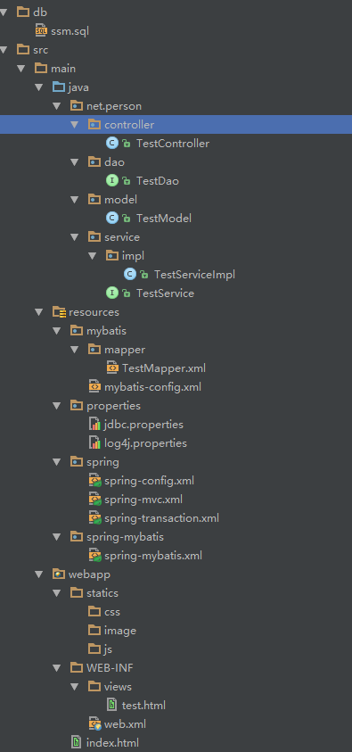
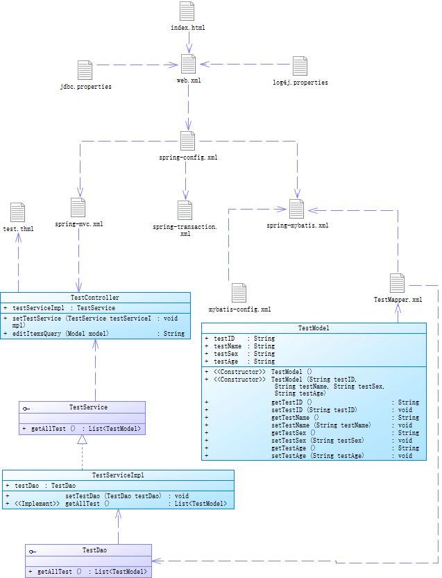
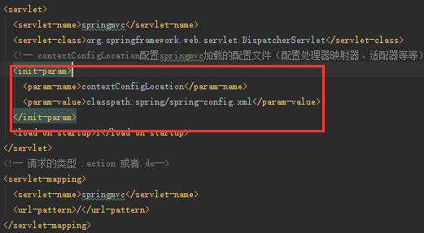

总操作流程：
- 1、创建数据库 
- 2、创建数据库文件(jdbc.properties)
- 3、修改pom.xml文件 
- 4、修改spring、mybati的xml文件 
- 5、修改映射文件
- 6、修改web.xml文件 
- 7、修改model，dao，service，html文件

[](https://github.com/lidekai/idea-maven-spring-springMVC-mybatis-mysql.git)


----------
- 项目目录结构



- 代码结构



# 创建数据库
```
CREATE DATABASE /*!32312 IF NOT EXISTS*/`ssm` /*!40100 DEFAULT CHARACTER SET latin1 */;

USE `ssm`;

DROP TABLE IF EXISTS `test`;

CREATE TABLE `test` (
  `testID` varchar(11) NOT NULL,
  `testName` varchar(20) NOT NULL,
  `testSex` varchar(20) NOT NULL,
  `testAge` varchar(11) NOT NULL,
  PRIMARY KEY (`testID`)
) ENGINE=InnoDB DEFAULT CHARSET=latin1;

insert  into `test`(`testID`,`testName`,`testSex`,`testAge`) values ('1','1','1','1');
insert  into `test`(`testID`,`testName`,`testSex`,`testAge`) values ('2','2','2','2');
insert  into `test`(`testID`,`testName`,`testSex`,`testAge`) values ('3','3','3','3');
insert  into `test`(`testID`,`testName`,`testSex`,`testAge`) values ('4','4','4','4');
```
# 创建数据库文件(jdbc.properties)
```
#dbcp连接池的mysql
db.driverLocation=/Users/imooc/mysql-connector-java-5.1.6-bin.jar
db.driverClassName=com.mysql.jdbc.Driver
db.url=jdbc:mysql://localhost:3306/ssm?characterEncoding=utf-8
db.username=root
db.password=123456


db.initialSize = 20
db.maxActive = 50
db.maxIdle = 20
db.minIdle = 10
db.maxWait = 10
db.defaultAutoCommit = true
db.minEvictableIdleTimeMillis = 3600000
```
# 修改pom.xml文件（原来的基础上添加）
```
版本设置处添加：
 
    <mybatiSpring.version>1.3.1</mybatiSpring.version><!--mybatis-spring-->
    <mysql.version>5.1.40</mysql.version><!--mysql驱动包-->
    <dbcp.version>1.4</dbcp.version><!--dbcp连接池-->
    <mybatis.version>3.2.8</mybatis.version><!--mybatis-->
    <slf4j.version>1.7.22</slf4j.version><!--slf4j-->
    <log4j.version>1.2.17</log4j.version><!--log4j-->
    
    
    
导包处添加：
    <!--=====================================mybatis=====================================-->
    <dependency>
      <groupId>org.mybatis</groupId>
      <artifactId>mybatis</artifactId>
      <version>${mybatis.version}</version>
    </dependency>
    <!--=====================================mybatis-spring=====================================-->
    <dependency>
      <groupId>org.mybatis</groupId>
      <artifactId>mybatis-spring</artifactId>
      <version>${mybatiSpring.version}</version>
    </dependency>
        <!--=====================================mysql驱动包=====================================-->
    <dependency>
      <groupId>mysql</groupId>
      <artifactId>mysql-connector-java</artifactId>
      <version>${mysql.version}</version>
    </dependency>
    <!--=====================================dbcp连接池=====================================-->
    <dependency>
      <groupId>commons-dbcp</groupId>
      <artifactId>commons-dbcp</artifactId>
      <version>${dbcp.version}</version>
    </dependency>
    <!--=====================================slf4j=====================================-->
    <dependency>
      <groupId>org.slf4j</groupId>
      <artifactId>slf4j-api</artifactId>
      <version>${slf4j.version}</version>
    </dependency>
    <dependency>
      <groupId>org.slf4j</groupId>
      <artifactId>slf4j-log4j12</artifactId>
      <version>${slf4j.version}</version>
    </dependency>
    <!--=====================================log4j=====================================-->
    <dependency>
      <groupId>log4j</groupId>
      <artifactId>log4j</artifactId>
      <version>${log4j.version}</version>
    </dependency>
```
# 修改spring、mybati的xml文件 
### 1、spring-config.xml
```
<?xml version="1.0" encoding="UTF-8"?>
<beans xmlns="http://www.springframework.org/schema/beans"
       xmlns:xsi="http://www.w3.org/2001/XMLSchema-instance"
       xsi:schemaLocation="http://www.springframework.org/schema/beans
                           http://www.springframework.org/schema/beans/spring-beans.xsd">
    <!-- 导入springMVC 与 springMybatis -->
    <import resource="../spring-mybatis/spring-mybatis.xml"/>
    <import resource="spring-transaction.xml"/>
    <import resource="spring-mvc.xml"/>
</beans>
```
### 2、spring-mvc.xml
```
<?xml version="1.0" encoding="UTF-8"?>
<beans xmlns="http://www.springframework.org/schema/beans"
       xmlns:xsi="http://www.w3.org/2001/XMLSchema-instance"
       xmlns:context="http://www.springframework.org/schema/context"
       xmlns:mvc="http://www.springframework.org/schema/mvc"
       xsi:schemaLocation="http://www.springframework.org/schema/beans
                        http://www.springframework.org/schema/beans/spring-beans-3.2.xsd
                         http://www.springframework.org/schema/context
                        http://www.springframework.org/schema/context/spring-context-3.2.xsd
                        http://www.springframework.org/schema/mvc
                        http://www.springframework.org/schema/mvc/spring-mvc.xsd">
    <!--=========================启用spring的一些annotation========================= -->
    <context:annotation-config/>

    <!-- =========================自动扫描该包，使SpringMVC认为包下用了@controller注解的类是控制器========================= -->
    <context:component-scan base-package="net.person.controller">
        <context:include-filter type="annotation" expression="org.springframework.stereotype.Controller"/>
    </context:component-scan>

    <!--=========================静态资源映射=========================-->
    <!--本项目把静态资源放在了WEB-INF的statics目录下，资源映射如下-->
    <mvc:resources mapping="/css/**" location="/statics/css/"/>
    <mvc:resources mapping="/js/**" location="/statics/js/"/>
    <mvc:resources mapping="/image/**" location="/statics/image/"/>


    <!-- 配置注解驱动 可以将request参数与绑定到controller参数上 -->
    <mvc:annotation-driven/>

    <!-- 对模型视图名称的解析，即在模型视图名称添加前后缀(如果最后一个还是表示文件夹,则最后的斜杠不要漏了) 使用JSP-->
    <!-- 默认的视图解析器 在上边的解析错误时使用 (默认使用html)- -->
    <bean id="defaultViewResolver" class="org.springframework.web.servlet.view.InternalResourceViewResolver">
        <property name="viewClass" value="org.springframework.web.servlet.view.JstlView"/>
        <property name="prefix" value="/WEB-INF/views/"/><!--设置JSP文件的目录位置-->
        <property name="suffix" value=".html"/>
    </bean>

    <!-- springmvc文件上传需要配置的节点-->
    <bean id="multipartResolver" class="org.springframework.web.multipart.commons.CommonsMultipartResolver">
        <property name="maxUploadSize" value="20971500"/>
        <property name="defaultEncoding" value="UTF-8"/>
        <property name="resolveLazily" value="true"/>
    </bean>
</beans>
```
### 3、spring-transaction.xml
```
<?xml version="1.0" encoding="UTF-8"?>
<beans xmlns="http://www.springframework.org/schema/beans"
       xmlns:xsi="http://www.w3.org/2001/XMLSchema-instance"
       xmlns:tx="http://www.springframework.org/schema/tx"
       xsi:schemaLocation="http://www.springframework.org/schema/beans
                           http://www.springframework.org/schema/beans/spring-beans.xsd
                           http://www.springframework.org/schema/tx
                           http://www.springframework.org/schema/tx/spring-tx.xsd">

    <!-- =========================事务管理========================= -->
    <tx:annotation-driven transaction-manager="transactionManager" proxy-target-class="true" /><!-- 配置基于注解的声明式事务 -->
    <bean id="transactionManager" class="org.springframework.jdbc.datasource.DataSourceTransactionManager"><!-- (事务管理)transaction manager, use JtaTransactionManager for global tx -->
        <property name="dataSource">
            <ref bean="dataSource"/>
        </property>
        <property name="rollbackOnCommitFailure" value="true"/>
    </bean>
</beans>
```
### 4、spring-mybatis.xml
```
<?xml version="1.0" encoding="UTF-8"?>
<beans xmlns="http://www.springframework.org/schema/beans"
       xmlns:xsi="http://www.w3.org/2001/XMLSchema-instance"
       xmlns:context="http://www.springframework.org/schema/context"
       xsi:schemaLocation="http://www.springframework.org/schema/beans
                           http://www.springframework.org/schema/beans/spring-beans.xsd
                           http://www.springframework.org/schema/context
                           http://www.springframework.org/schema/context/spring-context.xsd">

    <context:component-scan base-package="net.person" annotation-config="true"/>

    <bean id="propertyConfigurer"
          class="org.springframework.beans.factory.config.PropertyPlaceholderConfigurer">
        <property name="order" value="2"/>
        <property name="ignoreUnresolvablePlaceholders" value="true"/>
        <property name="locations">
            <list>
                <value>classpath:properties/jdbc.properties</value>
            </list>
        </property>
        <property name="fileEncoding" value="utf-8"/>
    </bean>
    <!-- =========================配置数据源 ，使用的dbcp的数据库========================= -->
    <bean id="dataSource" class="org.apache.commons.dbcp.BasicDataSource" destroy-method="close">
        <property name="driverClassName" value="${db.driverClassName}"/>
        <property name="url" value="${db.url}"/>
        <property name="username" value="${db.username}"/>
        <property name="password" value="${db.password}"/>
        <!-- 连接池启动时的初始值 -->
        <property name="initialSize" value="${db.initialSize}"/>
        <!-- 连接池的最大值 -->
        <property name="maxActive" value="${db.maxActive}"/>
        <!-- 最大空闲值.当经过一个高峰时间后，连接池可以慢慢将已经用不到的连接慢慢释放一部分，一直减少到maxIdle为止 -->
        <property name="maxIdle" value="${db.maxIdle}"/>
        <!-- 最小空闲值.当空闲的连接数少于阀值时，连接池就会预申请去一些连接，以免洪峰来时来不及申请 -->
        <property name="minIdle" value="${db.minIdle}"/>
        <!-- 最大建立连接等待时间。如果超过此时间将接到异常。设为－1表示无限制 -->
        <property name="maxWait" value="${db.maxWait}"/>
        <!--#给出一条简单的sql语句进行验证 -->
        <!--<property name="validationQuery" value="select getdate()" />-->
        <property name="defaultAutoCommit" value="${db.defaultAutoCommit}"/>
        <!-- 回收被遗弃的（一般是忘了释放的）数据库连接到连接池中 -->
        <!--<property name="removeAbandoned" value="true" />-->
        <!-- 数据库连接过多长时间不用将被视为被遗弃而收回连接池中 -->
        <!--<property name="removeAbandonedTimeout" value="120" />-->
        <!-- #连接的超时时间，默认为半小时。 -->
        <property name="minEvictableIdleTimeMillis" value="${db.minEvictableIdleTimeMillis}"/>

        <!--# 失效检查线程运行时间间隔，要小于MySQL默认-->
        <property name="timeBetweenEvictionRunsMillis" value="40000"/>
        <!--# 检查连接是否有效-->
        <property name="testWhileIdle" value="true"/>
        <!--# 检查连接有效性的SQL语句-->
        <property name="validationQuery" value="SELECT 1 FROM dual"/>
    </bean>

    <!-- =========================spring和MyBatis完美整合，不需要mybatis的配置映射文件========================= -->
    <bean id="sqlSessionFactory" class="org.mybatis.spring.SqlSessionFactoryBean">
        <property name="dataSource" ref="dataSource"/>
        <property name="mapperLocations" value="classpath:/mybatis/mapper/*Mapper.xml"/><!-- 自动扫描mapping.xml文件 -->
        <property name="configLocation" value="classpath:mybatis/mybatis-config.xml"/><!--别名设置-->
    </bean>
    <!-- DAO接口所在包名，Spring会自动查找其下的类 ,自动扫描了所有的XxxxMapper.xml对应的mapper接口文件,只要Mapper接口类和Mapper映射文件对应起来就可以了-->
    <bean class="org.mybatis.spring.mapper.MapperScannerConfigurer">
        <property name="basePackage" value="net.person.dao" />
        <property name="sqlSessionFactoryBeanName" value="sqlSessionFactory"></property>
    </bean>
</beans>
```
### 5、mybatis-config.xml
```
<?xml version="1.0" encoding="UTF-8"?>
<!DOCTYPE configuration PUBLIC "-//mybatis.org//DTD Config 3.0//EN" "http://mybatis.org/dtd/mybatis-3-config.dtd">
<configuration>
    <!-- 配置实体类的别名 -->
    <typeAliases>
        <package name="net.person.model"/>
    </typeAliases>
</configuration>
```
# 修改映射文件(TestMapper.xml)
```
<?xml version="1.0" encoding="UTF-8"?>
<!DOCTYPE mapper PUBLIC "-//mybatis.org//DTD Mapper 3.0//EN" "http://mybatis.org/dtd/mybatis-3-mapper.dtd">
<mapper namespace="net.person.dao.TestDao">
    <resultMap id="TestResultMap" type="TestModel">
        <id column="testID" property="testID" jdbcType="VARCHAR" />
        <result column="testName" property="testName" jdbcType="VARCHAR" />
        <result column="testSex" property="testSex" jdbcType="VARCHAR" />
        <result column="testAge" property="testAge" jdbcType="VARCHAR" />
    </resultMap>
    <!-- 查询test表所有数据 -->
    <select id="getAllTest" parameterType="TestModel" resultMap="TestResultMap">
        SELECT * FROM test
    </select>
</mapper>
```
# 修改web.xml文件

# 修改model，dao，service，html文件
### 1、model
```
package net.person.model;

/**
 * Created by admin on 2018/1/31.
 */
public class TestModel {
    public String testID;
    public String testName;
    public String testSex;
    public String testAge;
    public TestModel() {
        super();
    }
    public TestModel(String testID, String testName, String testSex, String testAge) {
        super();
        this.testID = testID;
        this.testName = testName;
        this.testSex = testSex;
        this.testAge = testAge;
    }
    public String getTestID() {
        return testID;
    }
    public void setTestID(String testID) {
        this.testID = testID;
    }
    public String getTestName() {
        return testName;
    }
    public void setTestName(String testName) {
        this.testName = testName;
    }
    public String getTestSex() {
        return testSex;
    }
    public void setTestSex(String testSex) {
        this.testSex = testSex;
    }
    public String getTestAge() {
        return testAge;
    }
    public void setTestAge(String testAge) {
        this.testAge = testAge;
    }
}
```
### 2、dao
```
package net.person.dao;

/**
 * Created by admin on 2018/1/31.
 */
import java.util.List;
import net.person.model.TestModel;

public interface TestDao {
    //获取test表所有数据
    public List<TestModel> getAllTest();
}
```
### 3、service
```
package net.person.service;

import net.person.model.TestModel;
import java.util.List;

/**
 * Created by admin on 2018/1/31.
 */
public interface TestService {
    //获取test表所有数据
    public List<TestModel> getAllTest();
}

```
### 4、serviceImpl
```
package net.person.service.impl;

import net.person.dao.TestDao;
import net.person.model.TestModel;
import net.person.service.TestService;
import org.springframework.beans.factory.annotation.Autowired;
import org.springframework.stereotype.Service;
import org.springframework.transaction.annotation.Transactional;
import java.util.List;

/**
 * Created by admin on 2018/1/31.
 */
@Service
@Transactional
public class TestServiceImpl implements TestService {

    public TestDao testDao;
    @Autowired
    public void setTestDao(TestDao testDao) {
        this.testDao = testDao;
    }
    public List<TestModel> getAllTest() {
        return testDao.getAllTest();
    }
}
```
### 5、Controller
```
package net.person.controller;

import net.person.model.TestModel;
import net.person.service.TestService;
import org.slf4j.Logger;
import org.slf4j.LoggerFactory;
import org.springframework.beans.factory.annotation.Autowired;
import org.springframework.stereotype.Controller;
import org.springframework.ui.Model;
import org.springframework.web.bind.annotation.RequestMapping;

import java.util.List;

/**
 * 测试springMVC映射
 * Created by admin on 2018/1/31.
 */
@Controller
@RequestMapping("/home")
public class TestController {
    //添加一个日志器
    public TestService testServiceImpl;
    @Autowired
    public void setTestService(TestService testServiceImpl) {
        this.testServiceImpl = testServiceImpl;
    }

    //映射一个action
    @RequestMapping("/index")
    public String editItemsQuery(Model model) throws Exception{
        List<TestModel> itemsList = testServiceImpl.getAllTest();
        System.out.println(itemsList.size());
        return "test";
    }
}

```
### 6、index.html
```
<!DOCTYPE html>
<html lang="en">
<head>
    <meta charset="UTF-8">
    <title>Title</title>
</head>
<body>
    <form action="home/index">
        <button type="submit">跳转</button>
    </form>
</body>
</html>
```
### 7、test.html
```
<!DOCTYPE html>
<html lang="en">
<head>
    <meta charset="UTF-8">
    <title>Title</title>
</head>
<body>
    <h1>11111</h1>
</body>
</html>
```
