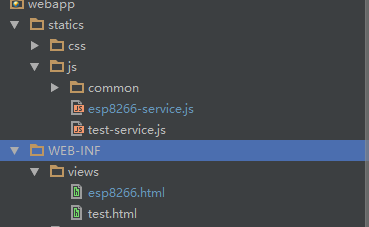

总操作流程：
- 1、创建model、dao、service，sql,xml
- 2、pom.xml引用jar包；
- 3、创建websocket处理类和创建握手（handshake）接口；
- 4、修改spring-mvc.xml文件；
- 5、修改html的js；

***
- 项目结构


# 创建model、sql、dao、xml,service
### 1、创建model
```
package net.person.model;

/**
 * Created by DK on 2018/6/3.
 */
public class TemHumDayModel {
    public String temHumDayId;
    public String tem;
    public String hum;
    public String day;

    public TemHumDayModel() {
        super();
    }

    public TemHumDayModel(String temHumDayId, String tem, String hum, String day) {
        super();
        this.temHumDayId = temHumDayId;
        this.tem = tem;
        this.hum = hum;
        this.day = day;
    }

    public String getTemHumDayId() {
        return temHumDayId;
    }

    public void setTemHumDayId(String temHumDayId) {
        this.temHumDayId = temHumDayId;
    }

    public String getTem() {
        return tem;
    }

    public void setTem(String tem) {
        this.tem = tem;
    }

    public String getHum() {
        return hum;
    }

    public void setHum(String hum) {
        this.hum = hum;
    }

    public String getDay() {
        return day;
    }

    public void setDay(String day) {
        this.day = day;
    }
}

```
### 2、sql

```
CREATE TABLE `temhumdaytb` (
  `TemVal` varchar(6) NOT NULL DEFAULT '0' COMMENT '温度的值',
  `HumVal` varchar(6) NOT NULL DEFAULT '0' COMMENT '湿度的值',
  `Day` varchar(3) NOT NULL DEFAULT '0' COMMENT '天数'
) ENGINE=InnoDB DEFAULT CHARSET=latin1 COMMENT='温度湿度天数表'
INSERT INTO ssm.temhumdaytb (TemHumDayId, Tem, Hum, Day) VALUES ('1', '23', '32', '34');
```
### 3、dao
```
package net.person.dao;

import net.person.model.TemHumDayModel;
import java.util.List;

/**
 * Created by DK on 2018/6/3.
 */
public interface TemHumDayDao {
    public List<TemHumDayModel> getAllTemHumDay();
}

```
### 4、xml
```
<?xml version="1.0" encoding="UTF-8"?>
<!DOCTYPE mapper PUBLIC "-//mybatis.org//DTD Mapper 3.0//EN" "http://mybatis.org/dtd/mybatis-3-mapper.dtd">
<mapper namespace="net.person.dao.TemHumDayDao">
    <resultMap id="TemHumDayResultMap" type="TemHumDayModel">
        <id column="temHumDayId" property="temHumDayId" jdbcType="VARCHAR" />
        <result column="tem" property="tem" jdbcType="VARCHAR" />
        <result column="hum" property="hum" jdbcType="VARCHAR" />
        <result column="day" property="day" jdbcType="VARCHAR" />
    </resultMap>
    <!-- 查询test表所有数据 -->
    <select id="getAllTemHumDay" parameterType="TemHumDayModel" resultMap="TemHumDayResultMap">
        SELECT * FROM temhumdaytb
    </select>
</mapper>
```
### service
#### 1、接口
```
public interface TemHumDayService {
    public String getAllTemHumDay();
}

```
#### 2、实现类
```
package net.person.service.impl;

import net.person.dao.TemHumDayDao;
import net.person.model.TemHumDayModel;
import net.person.model.json.ListObject;
import net.person.service.TemHumDayService;
import net.person.utils.JackJsonUtils;
import net.person.utils.StatusHouse;
import org.springframework.beans.factory.annotation.Autowired;
import org.springframework.stereotype.Service;
import org.springframework.transaction.annotation.Transactional;

import javax.servlet.http.HttpServletResponse;
import java.util.List;

/**
 * Created by DK on 2018/6/3.
 */
@Service
@Transactional
public class TemHumDayServiceImpl implements TemHumDayService {

    public TemHumDayDao temHumDayDao;
    @Autowired
    public void setTestDao(TemHumDayDao temHumDayDao) {
        this.temHumDayDao = temHumDayDao;
    }

    @Override
    public String getAllTemHumDay() {
        List<TemHumDayModel> list = temHumDayDao.getAllTemHumDay();
        ListObject listObject=new ListObject();
        listObject.setItems(list);
        listObject.setStatusObject(StatusHouse.COMMON_STATUS_OK);
        String responseText = JackJsonUtils.toJson(listObject);
        System.out.println(responseText);
        return responseText;
    }
}

```
# pom.xml引用jar包
```
    <springMessaging.version>4.0.5.RELEASE</springMessaging.version>
    <springWebsocket.version>4.0.5.RELEASE</springWebsocket.version>

    <!--============================websocket============================-->
    <dependency>
      <groupId>org.springframework</groupId>
      <artifactId>spring-messaging</artifactId>
      <version>${springMessaging.version}</version>
    </dependency>
    <dependency>
      <groupId>org.springframework</groupId>
      <artifactId>spring-websocket</artifactId>
      <version>${springWebsocket.version}</version>
    </dependency>
```
# 创建websocket处理类和创建握手（handshake）接口
[参考文献](https://blog.csdn.net/softwave/article/details/51994754)
### websocket
```
package net.person.websocket;

import net.person.service.TemHumDayService;
import org.springframework.beans.factory.annotation.Autowired;
import org.springframework.web.socket.TextMessage;
import org.springframework.web.socket.WebSocketSession;
import org.springframework.web.socket.handler.TextWebSocketHandler;
import javax.servlet.http.HttpServletResponse;

/**
 * Created by DK on 2018/6/3.
 */
public class WebsocketEndPoint extends TextWebSocketHandler {
    public TemHumDayService temHumDayServiceImpl;
    @Autowired
    public void setTestService(TemHumDayService temHumDayServiceImpl) {
        this.temHumDayServiceImpl = temHumDayServiceImpl;
    }

    @Override
    protected void handleTextMessage(WebSocketSession session,
                                     TextMessage message) throws Exception {
        super.handleTextMessage(session, message);
        TextMessage sendMessage;
        String getMessage = message.getPayload();
        if("getTemHumDay".equals(getMessage))
            sendMessage = new TextMessage(temHumDayServiceImpl.getAllTemHumDay());
        else
            sendMessage = new TextMessage("getTemHumDay Failed");
        session.sendMessage(sendMessage);
    }
}

```
### handshake
```
package net.person.websocket;

import org.springframework.http.server.ServerHttpRequest;
import org.springframework.http.server.ServerHttpResponse;
import org.springframework.web.socket.WebSocketHandler;
import org.springframework.web.socket.server.support.HttpSessionHandshakeInterceptor;

import javax.servlet.http.HttpSession;
import java.util.Map;

/**
 * Created by DK on 2018/6/3.
 */
public class HandshakeInterceptor extends HttpSessionHandshakeInterceptor {

    @Override
    public boolean beforeHandshake(ServerHttpRequest request,
                                   ServerHttpResponse response, WebSocketHandler wsHandler,
                                   Map<String, Object> attributes) throws Exception {
        return super.beforeHandshake(request, response, wsHandler, attributes);
    }

    @Override
    public void afterHandshake(ServerHttpRequest request,
                               ServerHttpResponse response, WebSocketHandler wsHandler,
                               Exception ex) {
        super.afterHandshake(request, response, wsHandler, ex);
    }
}

```
# 修改spring-mvc.xml文件
```
表头添加：
xmlns:websocket="http://www.springframework.org/schema/websocket"
xsi:schemaLocation="http://www.springframework.org/schema/websocket
                    http://www.springframework.org/schema/websocket/spring-websocket.xsd"
            
内容加：
    <bean id="websocket" class="net.person.websocket.WebsocketEndPoint"/>
    <websocket:handlers>
        <websocket:mapping path="/websocket" handler="websocket"/>
        <websocket:handshake-interceptors>
            <bean class="net.person.websocket.HandshakeInterceptor"/>
        </websocket:handshake-interceptors>
    </websocket:handlers>
```
# 修改html的js
[参考文献](https://www.cnblogs.com/fmixue/p/9110074.html)
```$xslt
new Vue({
    el: '#esp8266',
    data: {
        websock: null,
    },
    filters:{

    },
    created(){
        //页面刚进入时开启长连接
        this.initWebSocket()
    },
    destroyed: function() {
        //页面销毁时关闭长连接
        this.websocketclose();
    },
    mounted:function(){

    },
    methods: {
        threadPoxi(){  // 实际调用的方法
            //参数
            const agentData = "getTemHumDay";
            //若是ws开启状态
            if (this.websock.readyState === this.websock.OPEN) {
                this.websocketsend(agentData)
            }
            // 若是 正在开启状态，则等待300毫秒
            else if (this.websock.readyState === this.websock.CONNECTING) {
                let that = this;//保存当前对象this
                setTimeout(function () {
                    that.websocketsend(agentData)
                }, 300);
            }
            // 若未开启 ，则等待500毫秒
            else {
                this.initWebSocket();
                let that = this;//保存当前对象this
                setTimeout(function () {
                    that.websocketsend(agentData)
                }, 500);
            }
        },
        /**
         * 初始化weosocket
         */
        initWebSocket(){
            const wsuri ='ws://' + window.location.host +"/websocket";
            this.websock = new WebSocket(encodeURI(wsuri));
            this.websock.onmessage = this.websocketonmessage;
            this.websock.onclose = this.websocketclose;
            this.threadPoxi();
        },
        /**
         * 连接建立时触发
         */
        websocketsend(agentData){//数据发送
            this.websock.send(agentData);
        },
        /**
         * 客户端接收服务端数据时触发
         * @param e
         */
        websocketonmessage(e){
            const redata = JSON.parse(e.data);
            console.log(redata);


        },

        /**
         * 连接关闭时触发
         * @param e
         */
        websocketclose(){
            console.log("connection closed ");
        }
    }
})
```